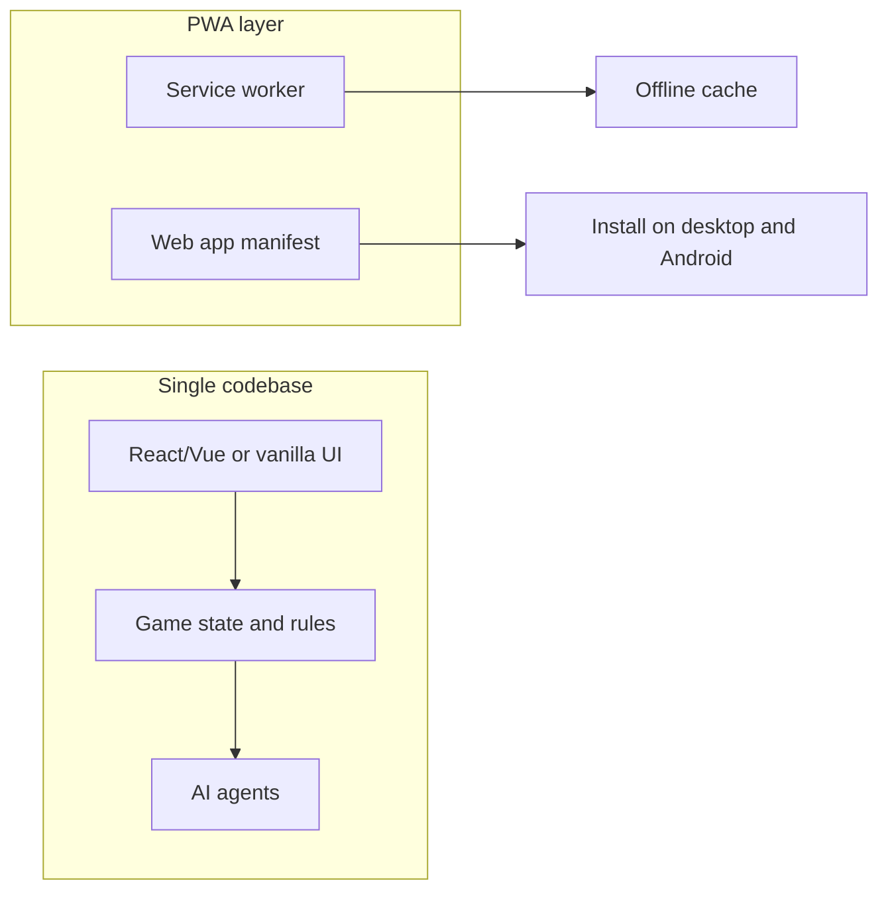

# Criss Cross Cribbage – Web + Android Offline Game

## Game summary (from CrossCribb rules)

- **Format**: 4 players, 2 teams of 2. You + 1 AI partner vs 2 AI opponents. First team to **peg 31 points** wins.
- **Board**: 5×5 grid. Your team owns the **5 columns** (score for you); the opponent team owns the **5 rows** (score for them). One shared **cut card** in the center.
- **Flow**: Each player is dealt 7 cards (face down). Each turn, a player flips one card and places it on any open square. Each player also discards one card to the **dealer’s crib** (4 discards + cut card; dealer’s team scores the crib). No table talk with partner.
- **Scoring**: Standard cribbage hand scoring per 5-card hand (15s, pairs, runs, flushes, His Heels, His Knobs). After the board is full, each team totals their five hands (plus crib for dealer); the team with the higher total pegs the **difference** on the track.

---

## Architecture

- **One codebase**: Web app (HTML/JS/CSS or a small framework).
- **Desktop**: Run in any modern browser.
- **Android**: Install as PWA (“Add to Home Screen”) or later wrap in a **Trusted Web Activity** for a store app; same code, no native UI.
- **Offline**: Service worker caches the app and assets so the game runs without the internet.

---

## Tech choices

| Concern       | Recommendation                                                                                                               |
| ------------- | ---------------------------------------------------------------------------------------------------------------------------- |
| **Framework** | **Vanilla JS + Vite** or **React + Vite** for fast dev and small bundle. No backend required.                                |
| **Offline**   | **Vite PWA plugin** (Workbox) to generate a service worker and cache app shell + assets.                                     |
| **Android**   | PWA first (install from browser). Optional later: **Bubblewrap** or **Capacitor** for a TWA/APK if you want a store listing. |
| **Layout**    | Responsive CSS (flex/grid); touch-friendly targets for phones.                                                               |

---

## Core implementation areas

### 1. Game engine (pure logic, no UI)

- **State**: 5×5 grid (which card in each cell, or empty), cut card, current player index, dealer index, 4 hands (7 cards each, then remaining after placements), crib (4 cards + cut), discard phase flags, score track (one value 0–31 per team).
- **Rules**:  
  - Turn order: deal → cut → then play clockwise; each turn = place one card on any open cell, and at some point before the end, each player must have discarded exactly one card to the crib.  
  - When board is full: compute five column hands for team A, five row hands for team B, plus crib for dealer; apply standard cribbage counting; peg the difference for the winning team; then new round (rotate dealer) until a team reaches 31.
- **Cribbage scoring**: Same as standard cribbage for a 5-card hand: 15s (2 pts each), pairs (2), runs (1 per card), flush (4 or 5 in hand; in crib only 5-card flush counts), His Heels (cut is J, 2 to dealer), His Knobs (J in hand/row/column same suit as cut, 1 pt). Implement as a pure function: `scoreHand(fiveCards, isCrib, cutCard) → number`.

References: [CrossCribb rules](https://ultraboardgames.com/crosscribb/game-rules.php) for board ownership (columns vs rows), crib, and 31-point goal.

### 2. AI (in-browser only, no network)

- **Three agents**: Partner (1) and opponents (2). All use the **same core logic**; only the **goal** differs:
  - **Your team (you + partner)**: Maximize your columns’ potential and minimize opponents’ rows’ potential; favor placements that help your columns and hurt their rows.
  - **Opponents**: Maximize their rows and minimize your columns.
- **Approach**:  
  - **Card placement**: For each legal move (open cell), evaluate by simulating that placement and scoring (or estimating) the resulting impact on column/row totals (e.g. count current 5-card hand score for that line, or use a small heuristic). Choose the move that maximizes your team’s expected gain (or minimizes opponent gain for blocking).  
  - **Crib discard**: When discarding to the crib, if you are dealer’s team, discard to maximize crib value; if not, discard to minimize it (e.g. avoid giving 15s and runs).
- **Complexity**: Start with **rule-based/heuristic AI** (no ML). No API calls; everything runs in JS so it works offline and is predictable.

### 3. UI (desktop + Android)

- **Board**: 5×5 grid; each cell shows a card or “empty”; center cell shows cut card. Clearly indicate which direction is “yours” (columns) vs “theirs” (rows), e.g. labels “Your columns” / “Their rows”.
- **Your hand**: Show your 7 cards (face down until you choose to play, or face up for simplicity); tap/click to select, then tap cell to place. Disable placing when it’s an AI turn.
- **Crib**: Area showing “Crib” and, when relevant, who is dealer; optionally show crib after the round for transparency.
- **Scores**: One score track (0–31) per team with pegs (e.g. “You & Partner: 12” vs “Opponents: 8”).
- **Turns**: Obvious “Your turn” / “Partner’s turn” / “Opponent 1” / “Opponent 2” and a short message when AI is thinking (e.g. “Partner is thinking…”).
- **New round / game over**: “Round over – you pegged 4” then “New round” or “Game over – you win!” when a team hits 31.
- **Responsive**: Same layout scales; large touch targets on mobile; optional “compact” mode for small screens (e.g. smaller cards, scroll if needed).

### 4. PWA and offline

- **Manifest**: `name`, `short_name`, `start_url`, `display: standalone`, `icons` (e.g. 192, 512). Enables “Install” in browser and “Add to Home Screen” on Android.
- **Service worker**: Cache first for HTML/JS/CSS and assets so the game runs fully offline after first load. Use Vite PWA plugin so the build produces the SW and precache list.
- **No external APIs**: All assets and logic local; no internet required after install.

### 5. Optional extras (later)

- **Muggins**: Optional rule: if a team undercounts, the other team can call “Muggins” and claim the missed points (implement as a toggle in settings).
- **Skunk / double skunk**: Optional tracking (e.g. win by 16+ = skunk, win by 31 = double skunk) for a “series” or stats.
- **Sound**: Optional card-place and win sounds (local files, no network).
- **Android store**: Wrap the same PWA in a Trusted Web Activity (e.g. Bubblewrap) to publish an APK if desired.

---

## Suggested file structure (high level)

- `index.html` – entry.
- `src/` (or equivalent):
  - `game/state.js` – board, hands, crib, scores, dealer, turn.
  - `game/rules.js` – legal moves, “place card”, “discard to crib”, “end round”, “peg”.
  - `game/score.js` – cribbage hand scoring (`scoreHand`).
  - `ai/strategy.js` – placement and crib discard heuristics; single entry like `getAIMove(state)` used for all three AIs with different goals (team id).
  - `ui/board.js`, `ui/hand.js`, `ui/score.js` – render board, your hand, score track.
  - `ui/app.js` – orchestrate: load state, your clicks → apply move → if AI turn, call `getAIMove` and apply in a small delay loop until round/game end.
- `manifest.json` (or generated by Vite PWA).
- Service worker generated at build time.
- `vite.config` with PWA plugin.

---

## Phased development steps (step-through learning)

You can build the app one phase at a time. Each phase has concrete steps and a short "what you'll see/learn" so you understand why we do it in this order.

### Phase 1: Project and "hello" app

**Goal:** Get a small web app running locally so you're comfortable with the tooling and where files live.

1. **Create the project** – Use Vite to scaffold a vanilla JS (or React) project in a new folder. You'll get `index.html`, `src/`, and a dev server command.
2. **Run the dev server** – Run `npm run dev` and open the URL in your browser. Confirm you see the default Vite page.
3. **Make a tiny change** – Edit `src/main.js` (or the entry file) to change one line of text. Save and see the browser update (hot reload). This confirms you're editing the right place and the server is watching.

**What you'll understand:** Where the entry point is, how the dev server works, and that edits in `src/` drive what you see in the browser.

### Phase 2: Game data and cribbage scoring (no UI yet)

**Goal:** Implement the "brain" of the game in plain JavaScript so we can test it without any buttons or layout. This keeps logic separate from presentation.

1. **Define card and board data structures** – In `src/game/state.js` (or similar), define how you represent a card (e.g. `{ suit, rank }`), a 5×5 grid (array or object keyed by row/col), and the cut card. Add a function that creates an empty game state (empty board, no cards in hands).
2. **Implement cribbage hand scoring** – In `src/game/score.js`, implement `scoreHand(fiveCards, isCrib, cutCard)` that returns the total points for one 5-card hand using standard cribbage rules (15s, pairs, runs, flush, His Knobs). You can test this in the browser console or with a tiny test script: pass in five cards and check the number.
3. **Test scoring with a few hands** – Manually call `scoreHand` with known hands (e.g. a run of 3-4-5, a pair, a 15) and verify the scores match the rules. This builds confidence before we hook it to the board.

**What you'll understand:** The game is just data (cards, grid, scores) and pure functions (scoring). No UI is required to prove the math is correct.

### Phase 3: Game rules and state updates

**Goal:** Implement "what is allowed" and "what happens when someone plays," so the app can advance a full round in code.

1. **Implement deal and cut** – Functions that: deal 7 cards to each of 4 players from a shuffled deck, then "cut" (choose a cut card and set dealer). State should include: four hands, cut card, dealer index, current player index.
2. **Implement legal moves** – A function that, given current state, returns legal (row, col) positions for the current player (any open cell). Optionally, a separate function for "which card can be discarded to crib" when it's that phase.
3. **Implement "place card" and "discard to crib"** – Functions that take the current state plus a move (place card at (r,c) or discard card X to crib), and return a new state (updated grid, updated hand, crib if applicable, next player). Keep state immutable (create new objects) so we can reason about turns.
4. **Implement end-of-round scoring and pegging** – When the board is full, compute column totals for your team, row totals for opponents, and crib for dealer. Determine which team won the round and by how much; update the score track (e.g. add difference to winner's total). Then return state for "new round" (rotate dealer, new deal, empty board).

**What you'll understand:** The whole game is a loop: state → legal moves → pick a move (human or AI) → new state → repeat until round ends, then peg and maybe start a new round or end the game at 31.

### Phase 4: Minimal UI – board and your turn only

**Goal:** See the board and your hand on screen; you can place a card and see the game advance. No AI yet.

1. **Render the 5×5 board** – In HTML/CSS, draw a 5×5 grid. Each cell is a clickable area (e.g. button or div). Use JS to read state and show either "empty" or the card (e.g. "7♥") in that cell. Center cell shows the cut card.
2. **Render your hand** – Show your 7 cards (e.g. as a row of card faces). When it's your turn, clicking a card "selects" it; clicking an empty cell "places" that card there. Call your "place card" logic and refresh the board and hand from the new state.
3. **Show scores and whose turn** – Display "Your team: X" and "Opponents: Y", and a line like "Your turn" or "Partner's turn". For now, when it's not your turn, you can either "pass" (placeholder) or we add a "Partner/opponent move" button that picks a random legal move so you can click through a full round.

**What you'll understand:** The UI only reads state and sends one kind of message: "user chose this move." All rules live in the game engine; the UI stays dumb and visual.

### Phase 5: AI for partner and opponents

**Goal:** Replace "random move" or "pass" with real AI so the game plays itself when it's not your turn.

1. **Implement a single AI function** – In `src/ai/strategy.js`, implement `getAIMove(state)` (or `getAIPlacement` and `getAICribDiscard`). It should take the current state and the current player's team id; return a legal placement (and optionally a crib discard when needed). Use simple heuristics: e.g. for each open cell, score the resulting column/row with `scoreHand` (or a quick estimate), and pick the cell that best helps your team / hurts the other team.
2. **Wire AI into the turn loop** – When the current player is the partner or an opponent, call `getAIMove(state)`, apply the returned move to state, then re-render. Add a short delay (e.g. 500 ms) so you can see each AI move. Loop until it's the human's turn or the round/game ends.
3. **Implement crib discard for AI** – When it's an AI's turn to discard to crib, have the same AI module choose which card to discard (maximize crib if dealer's team, minimize if not). Hook that into the state update and turn flow.

**What you'll understand:** AI is just "given state, return a move." The same game engine applies that move the same way it applies yours; the only difference is who chooses the move.

### Phase 6: Full game flow and polish

**Goal:** Play a complete game from deal to 31, with clear feedback and no crashes.

1. **Handle round end and new round** – When the board is full, show "Round over – you pegged N" (or opponents pegged N), then automatically start the next round (new deal, new cut, empty board) or show "Game over – you win!" when a team reaches 31.
2. **Indicate dealer and crib** – Show who the dealer is each round and where the crib is. Optionally reveal the crib after the round for transparency.
3. **Responsive and touch-friendly** – Adjust CSS so the board and cards scale on small screens; make buttons and cells large enough to tap on a phone. Test in browser dev tools device mode or on a real Android device.

**What you'll understand:** The same state machine (deal → play → score → peg → next round or game over) drives the whole experience; the UI just reflects state and sends moves.

### Phase 7: PWA and offline

**Goal:** The app works offline and can be "installed" on desktop and Android.

1. **Add the Vite PWA plugin** – Install and configure `vite-plugin-pwa` (with Workbox). Build the app; confirm a service worker and `manifest.json` (or equivalent) are generated.
2. **Configure the web app manifest** – Set `name`, `short_name`, `start_url`, `display: standalone`, and at least one icon (e.g. 192×192). This enables "Install" in the browser and "Add to Home Screen" on Android.
3. **Verify offline** – Load the app once online, then turn off the network (or use dev tools "Offline"). Reload the page; the game should still load and run. Fix caching if any critical script or asset fails to load.

**What you'll understand:** A PWA is your same web app plus a manifest and a service worker that caches files; no separate "backend" or native app is required for offline or install.

### How to use these phases

- **One phase at a time:** Finish Phase 1 before starting Phase 2, and so on. At the end of each phase you have something runnable or testable.
- **Ask for "next step" when ready:** You can say e.g. "Let's do Phase 1" or "Walk me through Phase 2 step 4" and we'll do only those steps, with explanations tailored to your level.
- **Test as you go:** After each step, run the app or run a small test so you see the result and catch mistakes early.

---

## Summary

- **Game**: Criss Cross Cribbage (CrossCribb rules): 5×5 grid, your team’s columns vs opponents’ rows, crib, first to 31.
- **Players**: You + 1 AI partner vs 2 AI opponents; all AI runs in-browser with rule-based strategy.
- **Platform**: One web app; PWA for offline and install on desktop and Android; no backend.
- **Scope**: Start with core engine, cribbage scoring, one heuristic AI for all three agents, and a clear responsive UI; add PWA and offline next; then optional rules and polish.

